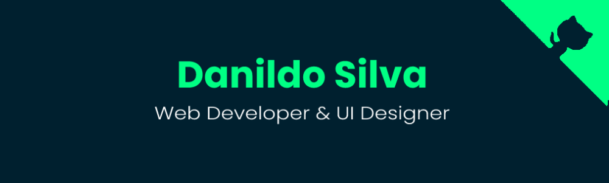

# Hello World! 

👽 I'm Danildo Silva. I'm 24 yo, based on Cape Verde 💙 In love with Programming since 2020  🨠I'm a Frontend Developer & UI Designer 🔭 I’m currently working on a e-commerce website 🧪 I’m currently learning JavaScript 👯 I’m looking to collaborate on UI Design and CSS 💬 Ask me about Figma, HTML & CSS 📫 How to reach me: <a href="mailto:danildosilva@proton.me">Link text</a> 
 

## 🌐 Connect with Me:
   
 
 

## 💻 Some tools I've used and Learned:
       	   
 
 

## 📊 My GitHub Stats:

 

### ✍️ Random Dev Quote

---

